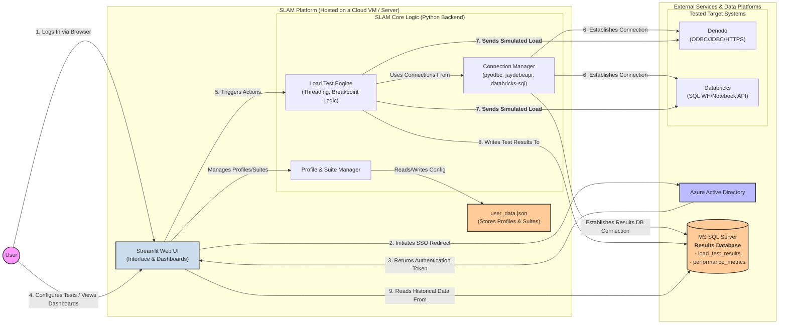

```mermaid
graph LR
    %% Define Styles for different component types
    classDef userStyle fill:#f9f,stroke:#333,stroke-width:2px;
    classDef appStyle fill:#cde,stroke:#333,stroke-width:2px;
    classDef dbStyle fill:#fc9,stroke:#333,stroke-width:2px;
    classDef externalStyle fill:#bbf,stroke:#333,stroke-width:2px;

    %% Define the main actor
    U((User)):::userStyle

    %% Define the SLAM Platform components within a subgraph
    subgraph "SLAM Platform (Hosted on a Cloud VM / Server)"
        UI["Streamlit Web UI<br/>(Interface & Dashboards)"]:::appStyle
        subgraph "SLAM Core Logic (Python Backend)"
            CM["Connection Manager<br/>(pyodbc, jaydebeapi, databricks-sql)"]
            LT["Load Test Engine<br/>(Threading, Breakpoint Logic)"]
            PSM["Profile & Suite Manager"]
        end
        JSON["user_data.json<br/>(Stores Profiles & Suites)"]:::dbStyle
    end

    %% Define External services and targets
    subgraph "External Services & Data Platforms"
        AAD["Azure Active Directory"]:::externalStyle
        DB[("MS SQL Server<br/><b>Results Database</b><br/>- load_test_results<br/>- performance_metrics")]:::dbStyle
        subgraph "Tested Target Systems"
            Denodo["Denodo<br/>(ODBC/JDBC/HTTPS)"]
            DBX["Databricks<br/>(SQL WH/Notebook API)"]
        end
    end

    %% Define the interactions between components with numbered flow
    U -- "1. Logs In via Browser" --> UI
    UI -- "2. Initiates SSO Redirect" --> AAD
    AAD -- "3. Returns Authentication Token" --> UI

    U -- "4. Configures Tests / Views Dashboards" --> UI
    UI -- "5. Triggers Actions" --> LT
    UI -- "Manages Profiles/Suites" --> PSM

    PSM -- "Reads/Writes Config" --> JSON

    LT -- "Uses Connections From" --> CM
    CM -- "6. Establishes Connection" --> Denodo
    CM -- "6. Establishes Connection" --> DBX
    CM -- "Establishes Results DB Connection" --> DB

    LT -- "<b>7. Sends Simulated Load</b>" --> Denodo
    LT -- "<b>7. Sends Simulated Load</b>" --> DBX

    LT -- "8. Writes Test Results To" --> DB
    UI -- "9. Reads Historical Data From" --> DB
```